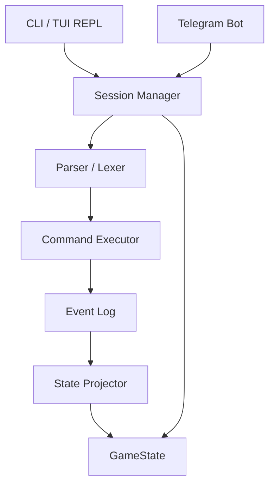

# DnDSL

<div align="center">


**The ultimate command-line engine for D&D 5e encounters.**

[](https://goreportcard.com/report/github.com/suderio/dndsl)
[](https://godoc.org/github.com/suderio/dndsl)
[](https://opensource.org/licenses/MIT)
[](https://github.com/suderio/dndsl/releases)
[](https://github.com/suderio/dndsl/actions)
[](https://github.com/suderio/dndsl/releases)
[](https://github.com/suderio/dndsl/releases)

*Process combat, roll dice, and manage campaigns through a powerful, human-readable Domain Specific Language.*

[Explore the Docs](docs/) · [Report Bug](https://github.com/suderio/dndsl/issues) · [Request Feature](https://github.com/suderio/dndsl/issues)

</div>

---

*(Placeholder: Amazing GIF of the Bubble Tea TUI here)*

---

## 📖 Introduction

**DnDSL** is a developer-centric tool for Dungeons & Dragons Game Masters. It provides a structured, terminal-based interface (powered by Bubble Tea) to manage complex combat encounters. By using an event-sourced architecture, every roll, hit, and turn is recorded in an immutable log, ensuring your campaign's history is safe and fully reproducible.

### Why DnDSL?

- **Speed**: No more clicking through complex UIs. Type `attack with: Longsword to: Orc_1` and let the engine handle the rest.
- **Precision**: Automated damage resistance, immunity, and vulnerability calculations.
- **Remote-First**: Built-in Telegram bot integration allows players to roll from their phones while the GM runs the engine on a server.
- **Customizable**: Purely YAML-based data layer. Adding a new monster or character is as simple as creating a file.

---

## 🛠 Installation

### Pre-built Binaries

Download the latest release from the [Releases](https://github.com/suderio/dndsl/releases) page.

### From Source

```bash
git clone https://github.com/suderio/dndsl.git
cd dndsl
go build -o dndsl main.go
```

#### Prerequisites

- Go 1.25 or higher.

### Setup Your First Campaign

```bash
# Create a new world and campaign
./dndsl campaign create "SwordCoast" "LostMine"

# Add some participants
./dndsl add elara and: thorne

# Start the interactive REPL
./dndsl repl SwordCoast LostMine
```

---

## ⚔️ DSL Usage Examples

The language is designed to be self-documenting. Use the `help` command for contextual guidance.

**Roll for Initiative:**

```bash
initiative
```

**Attack and Damage:**

```bash
attack with: Longsword to: Goblin_A
damage with: Longsword dice: 1d8+3 type: slashing
```

**Universal Checks:**

```bash
ask check: athletics of: Elara dc: 15 fails: prone
check athletics
```

---

## 📱 Telegram Integration

Play from anywhere! Configure a bot to let your players interact with the campaign via Telegram.

1. **Register Bot**: `dndsl bot telegram --token YOUR_TOKEN`
2. **Link Campaign**: `dndsl campaign telegram [world] [campaign] --chat_id YOUR_CHAT_ID`
3. **Map Users**: `dndsl campaign telegram [world] [campaign] --user Elara:123456`
4. **Play**: Simply run the `repl` and your bot will start polling for messages starting with `/`.

---

## 🗺 Roadmap

- [x] Context-aware Autocomplete (REPL)
- [x] Damage Defenses (Resistance/Immunity)
- [x] Telegram Bot Polling
- [ ] Automatic Spell Slot Management
- [ ] Local Web Dashboard (Vite + React)
- [ ] Monster Recharge Logic
- [ ] Discord Bot Integration

---

## 🤝 Contributing

Contributions are what make the open-source community such an amazing place to learn, inspire, and create. Any contributions you make are **greatly appreciated**.

Please see [CONTRIBUTING.md](CONTRIBUTING.md) for details on our code of conduct and the process for submitting pull requests.

### Architecture Overview

The engine follows a strict Event Sourcing pattern to maintain high reliability and state predictability.



---

## 📜 License

Distributed under the MIT License. See [LICENSE](LICENSE) for more information.

<div align="center">
 Built with ❤️ by the DnDSL Team.
</div>
