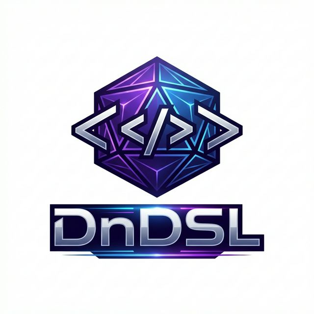
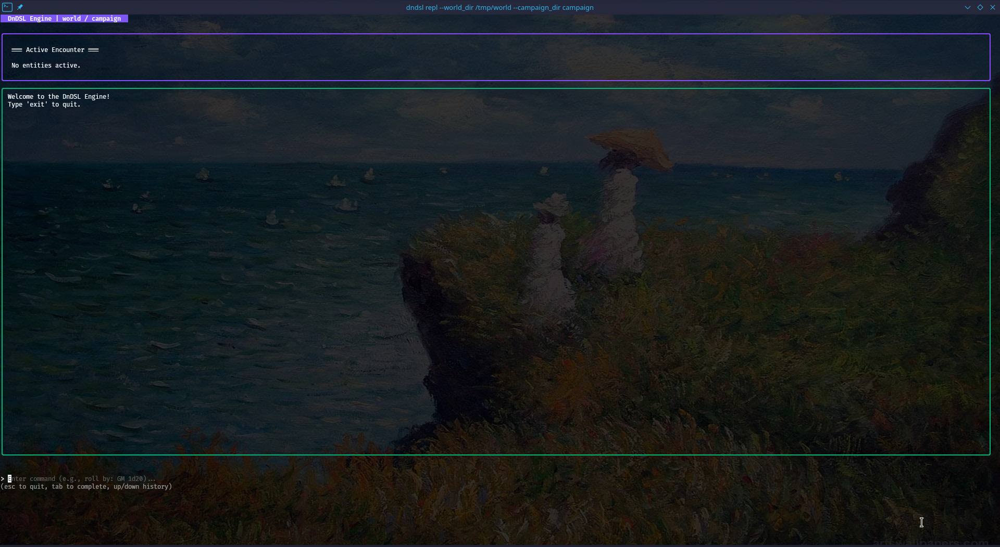
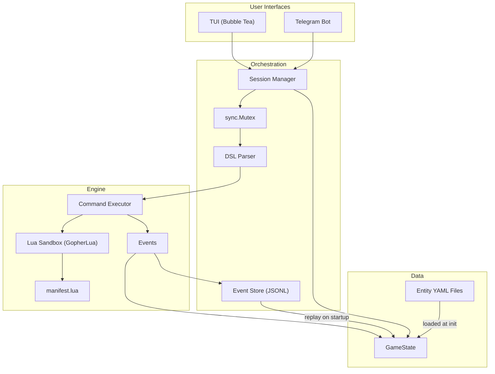

# Ancient Draconic

<div align="center">



**A scriptable, event-sourced engine for tabletop RPGs.**

[](https://goreportcard.com/report/github.com/suderio/ancient-draconic)
[](https://godoc.org/github.com/suderio/ancient-draconic)
[](https://opensource.org/licenses/MIT)
[](https://github.com/suderio/ancient-draconic/actions)
[](https://github.com/suderio/ancient-draconic/releases)
[](https://github.com/suderio/ancient-draconic/releases)

*Define game rules in Lua. Run combat from the terminal. Let your players roll from Telegram.*

[Explore the Docs](docs/) · [Report Bug](https://github.com/suderio/ancient-draconic/issues) · [Request Feature](https://github.com/suderio/ancient-draconic/issues)

</div>

---



---

## What is Ancient Draconic?

Ancient Draconic is a command-line game engine for tabletop RPGs. You type commands in a human-readable DSL, and the engine resolves dice rolls, applies game rules, tracks state, and records every event in an immutable log.

What makes it different:

- **Rules are Lua scripts, not code.** Game logic lives in a `manifest.lua` file. To change how grappling works or add a new spell, you edit Lua — no Go recompilation required.
- **Event-sourced state.** Every roll, condition change, and HP update is persisted as a JSON event. Close the terminal, come back next week, and resume exactly where you left off.
- **System-agnostic.** The engine doesn't hardcode D&D, PbtA, or any specific system. You author the rules in your manifest; the engine executes them.
- **Players connect via Telegram.** The GM runs the TUI locally; players interact through a Telegram bot. Everyone shares the same game state.

### **The Problem: The "Crunch" vs. "Time" Paradox**

Tabletop RPGs are more popular than ever, but the "Table Time" required to play them is becoming a luxury few can afford. Between managing 400-page rulebooks, setting up complex 3D VTTs, and tracking HP for five different **Zombies**, the actual *playing* often takes a backseat to the *math*.

### **The Solution: Ancient Draconic**

Ancient Draconic addresses this by **eliminating** the need for VTTs and **streamlining** the process of tracking state. You define your rules in Lua, and the engine handles the rest.

## 🛠 Strategic Approach to Market Saturation

To stand out in a saturated market, Ancient Draconic focuses on three distinct pillars that traditional VTTs and rulebooks ignore:

- **Scriptable, event-sourced engine for tabletop RPGs**. It's designed to be **rules-agnostic**, allowing you to define your own game logic in Lua. The engine handles the rest, including dice rolling, state tracking, and event logging.
- **Efficiency of text**. A text interface allows for rapid-fire combat without the "click-and-drag" fatigue of graphical maps.
- **Graphical niceties**. Future updates will introduce TUI (Terminal User Interface) elements—like health bars and ASCII maps—that provide visual feedback without sacrificing the speed of a keyboard-driven workflow.
- **Digital Dungeon Master assistant**. The engine acts as a digital Dungeon Master assistant. When a **Zombie** hits 0 HP, the engine doesn't just delete it; it pauses and prompts the user for the **Undead Fortitude** save, ensuring rules aren't forgotten in the heat of the moment.

---

## How It Works

### The Manifest

Every "world" (game system) contains a `manifest.lua` that defines commands, restrictions, and formulas:

```lua
-- world/dnd5e/manifest.lua

function mod(val)
    if not val then return -5 end
    return math.floor(val / 2) - 5
end

commands = {
  encounter_start = {
    name = "encounter start",
    prereq = {
      { name = "check_conflict",
        formula = function() return not is_encounter_start_active end,
        error = "an encounter is already active" }
    },
    game = {
      { name = "create_loop",  formula = true,  event = "LoopEvent" },
      { name = "order_loop",   formula = false,  event = "LoopOrderAscendingEvent" },
    },
  },

  initiative = {
    name = "initiative",
    game = {
      { name = "roll_score",
        formula = function() return roll("1d20") + mod(actor.stats.dex) end,
        event = "LoopOrderEvent",
        loop = "encounter_start" }
    },
  },
}
```

Formulas can be **inline strings** (`"actor.stats.str > 10"`) or **Lua closures** (`function() ... end`) for complex logic. The engine evaluates them at execution time with the current game context injected as globals (`actor`, `target`, `command`, `game`, etc.).

### The DSL

Commands are typed as natural-language phrases. Multi-word commands are joined with underscores internally:

```bash
encounter start                        # → encounter_start
initiative                             # → initiative
grapple by: Fighter to: Goblin_A       # → grapple, actor=Fighter, target=Goblin_A
check skill: athletics dc: 15          # → check, params={skill: athletics, dc: 15}
roll dice: 2d6+3                       # → roll (hardcoded), params={dice: 2d6+3}
```

The parser extracts `by:` as the actor, `to:` / `of:` as targets, and everything else as named parameters. If no actor is specified, it defaults to `GM`.

### The Execution Pipeline

Every command flows through the same pipeline:

```text
Input → Parse → Restrictions → Params → Prereq → Game → Targets → Actor → Events
```

1. **Restrictions**: GM-only commands and adjudication checks.
2. **Params**: Required parameter validation.
3. **Prereq**: Boolean formulas that must pass (e.g., "is there an active encounter?").
4. **Game**: Steps that run once (dice rolls, loop creation).
5. **Targets**: Steps that run per-target (ask for saves, apply conditions).
6. **Actor**: Steps that run once for the acting entity (consume actions).

Each step can emit an **Event** — a typed struct that modifies game state when applied.

### Event Sourcing

Events are appended to a `log.jsonl` file and replayed on startup to rebuild in-memory state:

```json
{"type":"LoopEvent","loop_name":"encounter_start","active":true}
{"type":"LoopOrderEvent","loop_name":"encounter_start","actor_id":"fighter","value":17}
{"type":"ConditionEvent","actor_id":"goblin","condition":"grappled","add":true}
```

This means:

- **Full history**: every action is recorded.
- **Reproducibility**: replay the log to reconstruct any past state.
- **Portability**: share a campaign by copying its directory.

---

## Architecture

```text
main.go                        # Entrypoint
cmd/                           # CLI commands, TUI (Bubble Tea), Telegram bot startup
internal/
  engine/                      # Game engine core
    types.go                   #   Data structures (Entity, GameState, Events)
    lua.go                     #   Lua sandbox, evaluator, manifest parser
    executor.go                #   Command execution pipeline
    hardcoded.go               #   Built-in commands (roll, help, hint, ask)
    manifest.go                #   YAML manifest loader (legacy)
  session/                     # Session orchestration
    session.go                 #   Manifest loading, event store, state management
    input.go                   #   DSL parser
    store.go                   #   Event persistence (JSONL)
  telegram/                    # Telegram bot integration
  data/                        # Entity YAML loaders
  dnd5eapi/                    # D&D 5e SRD API client
world/                         # Game system definitions
  dnd5e/
    manifest.lua               #   Lua-based game rules
    manifest.yaml              #   Legacy YAML rules
    data/characters/           #   Character YAML files
    data/monsters/             #   Monster YAML files
```

**Dependency flow**: `cmd → session → engine`. The engine owns the Lua sandbox; the session serializes access with a `sync.Mutex`.

---

## Installation

### Pre-built Binaries

Download the latest release from the [Releases](https://github.com/suderio/ancient-draconic/releases) page.

### From Source

```bash
git clone https://github.com/suderio/ancient-draconic.git
cd ancient-draconic
go build -o draconic main.go
```

**Requires**: Go 1.22 or higher.

---

## Quick Start

```bash
# Create a campaign under the dnd5e world
./draconic campaign create dnd5e MyQuest

# Start the TUI
./draconic repl dnd5e MyQuest

# Inside the TUI:
> encounter start
> initiative by: Fighter
> grapple by: Fighter to: Goblin
> encounter end
```

Use `help` for a full command list, or `help <command>` for usage details.

---

## Telegram Integration

Let players roll from their phones while the GM runs the engine locally.

1. **Register your bot**: `./draconic bot telegram --token YOUR_BOT_TOKEN`
2. **Link a campaign**: `./draconic campaign telegram dnd5e MyQuest --chat_id CHAT_ID`
3. **Map players**: `./draconic campaign telegram dnd5e MyQuest --user Elara:123456`
4. **Start the REPL**: the bot starts polling automatically.

Players send commands prefixed with `/` in the Telegram chat. The engine processes them through the same pipeline as the TUI.

---

## Writing Your Own Rules

To create a new game system:

1. Create a directory: `world/my_system/`
2. Write a `manifest.lua` defining your `commands` and `restrictions` tables.
3. Add entity YAML files under `data/characters/` and `data/monsters/`.
4. Run: `./draconic repl my_system my_campaign`

The Lua sandbox provides:

| Global             | Type       | Description                                    |
|:-------------------|:-----------|:-----------------------------------------------|
| `actor`            | table      | The entity performing the command              |
| `target`           | table      | The current target entity (in target steps)    |
| `command`          | table      | Parsed command parameters                      |
| `game`             | table      | Results from game-phase steps                  |
| `targets`          | table      | Results from target-phase steps                |
| `roll(s)`          | function   | Roll dice (e.g., `roll("2d6")`)                |
| `is_<loop>_active` | boolean    | Whether a named loop is currently active       |

Standard Lua libraries available: `base`, `table`, `string`, `math`. File I/O, OS access, and debug are **not** available.

---

## Roadmap

- [x] Lua-powered manifest engine
- [x] Context-aware TUI autocomplete
- [x] Event-sourced state persistence
- [x] Telegram bot integration
- [x] Hybrid formula evaluation (strings + closures)
- [x] Thread-safe concurrent access
- [ ] Web dashboard
- [ ] Discord bot integration
- [ ] Undo / time-travel commands
- [ ] Spell slot management primitives

---

## Contributing

Contributions are welcome. See [CONTRIBUTING.md](CONTRIBUTING.md) for guidelines.

### Architecture Overview

The engine follows a strict **Event Sourcing** pattern and is intentionally decoupled from any specific game system — all rules live in Lua manifests, not in Go code.


```mermaid
graph TD
    subgraph "User Interfaces"
        TUI["TUI (Bubble Tea)"]
        TG["Telegram Bot"]
    end

    subgraph "Orchestration"
        SM["Session Manager"]
        MX["sync.Mutex"]
        PS["DSL Parser"]
        ES["Event Store (JSONL)"]
    end

    subgraph "Engine"
        EX["Command Executor"]
        LUA["Lua Sandbox (GopherLua)"]
        ML["manifest.lua"]
        EV["Events"]
    end

    subgraph "Data"
        GS["GameState"]
        ENT["Entity YAML Files"]
    end

    TUI --> SM
    TG --> SM
    SM --> MX
    MX --> PS
    PS --> EX
    EX --> LUA
    LUA --> ML
    EX --> EV
    EV --> ES
    EV --> GS
    ES -->|"replay on startup"| GS
    SM --> GS
    ENT -->|"loaded at init"| GS
```

**Key design constraints:**

- `cmd/` → `internal/session` → `internal/engine` (strict dependency direction; no reverse imports).
- `internal/telegram` depends on nothing — it defines an `Executor` interface that `cmd/` adapts.
- The Lua sandbox only exposes `base`, `table`, `string`, and `math`. No `os`, `io`, or `debug`.
- The `Session.Execute()` method is protected by a `sync.Mutex`, making it safe for concurrent TUI + Telegram access.

---

## License

Distributed under the MIT License. See [LICENSE](LICENSE) for more information.

<div align="center">
 Built with ❤️ by the Ancient Draconic Team.
</div>
