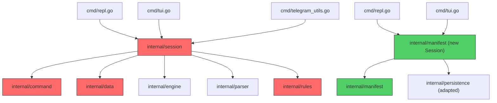

# Phase 16: CLI Re-wiring to `internal/manifest`

## Goal

Replace the legacy `internal/session` → `internal/{command,rules,engine,data,parser}` chain with the new `internal/manifest` package. The REPL, TUI, and Telegram bot should all use the new engine.

## Dependency Analysis



Red = to be replaced. Green = new path.

### Files that need changes

| File | Change | Reason |
|------|--------|--------|
| `cmd/repl.go` | **Minor** | Replace `session.NewSession` with new `manifest.NewSession` |
| `cmd/tui.go` | **Moderate** | Replace `session.Session` type, update `renderState()` to use `manifest.GameState` instead of `engine.GameState` |
| `cmd/telegram_utils.go` | **Minor** | Update `session.Session` type |
| `cmd/load.go` | **Skip for now** | Uses `engine.Projector` for replaying legacy logs. Not critical path. **TODO**: rewrite `load.go` to rebuild state from `manifest.Event` log once migration is complete. |
| `cmd/create.go` | **No change** | Only uses `persistence.CampaignManager` |
| `cmd/bot.go` | **No change** | Only uses viper config |
| `cmd/campaign_telegram.go` | **No change** | Entity validation is just a warning and uses legacy `data.Loader`. Drop it for now; the user mapping works without it. |

### Core new code needed

| File | Purpose |
|------|---------|
| `internal/manifest/session.go` | New Session: ties together manifest loading, command execution, persistence, and input parsing |
| `internal/manifest/store.go` | JSONL persistence for `manifest.Event`. Reuses `persistence.CampaignManager` for path resolution. |
| `internal/manifest/input.go` | Simple string-based input parser (no Participle). The Participle dependency stays in `go.mod` for legacy code but is not used by the new engine path. |

---

## Proposed Changes

### `internal/manifest` package

#### [NEW] `internal/manifest/input.go` — Input Parser

Simple string parser (no Participle dependency) that handles the DSL format:

```text
<command> [by: <actor>] [<key>: <value> [and: <value>]*]*
```

Returns:

```go
type ParsedInput struct {
    Command  string
    ActorID  string
    Targets  []string
    Params   map[string]any
}
```

Multi-word commands supported: `encounter start` → key `encounter_start`.

#### [NEW] `internal/manifest/store.go` — Persistence

New store that serializes `manifest.Event` to JSONL, independent of the legacy `engine.Event` types.

```go
type Store struct { file *os.File }
func (s *Store) Append(evt Event) error
func (s *Store) Load() ([]Event, error)
func (s *Store) Close() error
```

> [!IMPORTANT]
> This means new campaigns will use a different event log format than existing ones. Existing `log.jsonl` files from the legacy engine will **not** be compatible. This is acceptable — we are breaking things now.
>
> **Persistence reuse**: `persistence.CampaignManager` (directory creation, path resolution) is fully reusable — no engine dependency. Only `persistence.Store` (event serialization) needs replacement because it's coupled to `engine.Event` via a 15-case type switch. The new `manifest/store.go` follows the same JSONL pattern but uses `manifest.Event` types.

#### [NEW] `internal/manifest/session.go` — Session

The main orchestrator:

```go
type Session struct {
    manifest  *Manifest
    state     *GameState
    store     *Store
    eval      *Evaluator
    dataDirs  []string
}

func NewSession(dataDirs []string, storePath string) (*Session, error)
func (s *Session) Execute(input string) ([]Event, error)
func (s *Session) State() *GameState
```

- `NewSession`: loads the manifest, creates the evaluator, opens the store, rebuilds state from event log
- `Execute`: parses input → calls `ExecuteCommand` → applies events → persists → returns events

---

### CLI commands

#### [MODIFY] [repl.go](file:///home/paulo/org/projetos/dndsl/cmd/repl.go)

- Replace `session.NewSession(dataDirs, store)` with `manifest.NewSession(dataDirs, storePath)`
- Remove `persistence` import
- Pass `manifest.Session` to `RunTUI` and `maybeStartBot`

#### [MODIFY] [tui.go](file:///home/paulo/org/projetos/dndsl/cmd/tui.go)

- Replace `*session.Session` with `*manifest.Session`
- Update `renderState()`: replace `state.IsEncounterActive`, `state.TurnOrder`, `state.CurrentTurn`, `state.IsFrozen()` with loop-based equivalents from `manifest.GameState`
- Update autocomplete: replace `m.app.Loader().LoadManifest()` with direct manifest access
- Update `Execute()` call: now returns `[]Event, error` instead of `Event, error`
- Message display: iterate all returned events

#### [MODIFY] [telegram_utils.go](file:///home/paulo/org/projetos/dndsl/cmd/telegram_utils.go)

- Replace `*session.Session` with `*manifest.Session`

---

### Telegram integration

#### [MODIFY] [worker.go](file:///home/paulo/org/projetos/dndsl/internal/telegram/worker.go)

- Update `Executor` interface: `Execute(string) ([]manifest.Event, error)` instead of `(engine.Event, error)`
- Update `formatEvent` to handle `manifest.Event`

> [!WARNING]
> Changing the `Executor` interface in `internal/telegram/worker.go` is a cross-package change. This is one of the "absolutely needed" changes outside `internal/manifest/`.

---

## Verification Plan

### Automated Tests

The new `session.go`, `store.go`, and `input.go` will have unit tests:

```bash
go test -v ./internal/manifest/...
```

Specific test cases:

- **`TestInputParsing`** — various command formats (with/without actor, targets, params)
- **`TestStoreRoundTrip`** — append events, load them back, verify equality
- **`TestSessionExecute`** — end-to-end: parse input → execute → verify state change
- **`TestSessionRebuild`** — replay event log and verify state matches

### Build Verification

```bash
go build ./...
```

### Existing Tests (must still pass)

```bash
go test ./...
```

### Manual Verification

After implementation, verify the REPL works end-to-end:

1. Create a new campaign: `draconic campaign create --world_dir ./world/dnd5e -c test_campaign`
2. Start the REPL: `draconic repl --world_dir ./world/dnd5e -c test_campaign`
3. Test commands in order:
   - `help` → should list all commands from manifest
   - `help encounter_start` → should show specific help
   - `encounter start` → should fail (not GM? or succeed if GM is default)
   - `roll dice: 1d20` → should roll and display
   - `hint` → should show last command's hint
   - `exit` → should quit cleanly
